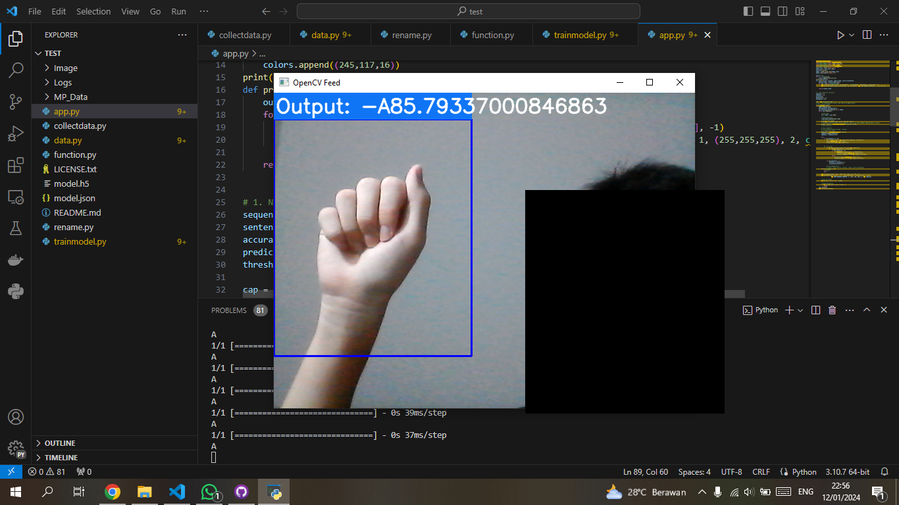
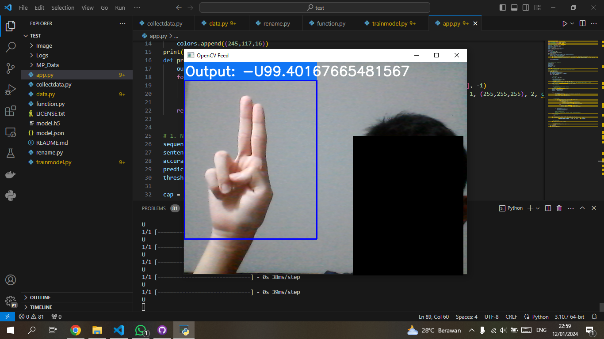
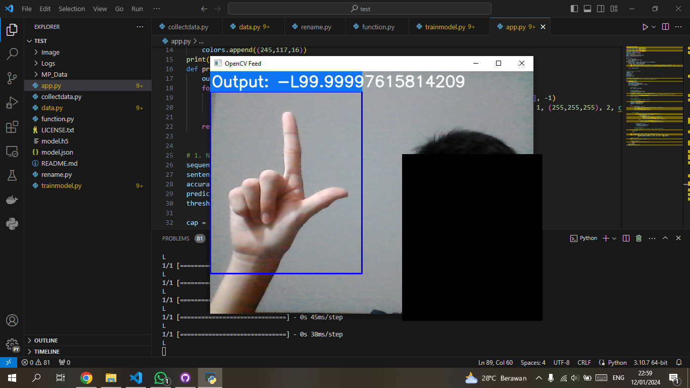

# SignalSolvers
Team name   : SignalSolvers  
1) Rasyid Al-Luthfi Sukafdi (Hustler) 
2) Tanesha Angeline Phangelisa (Hipster) 
3) Pieter Christy Yan Yudhistira (Hacker) 
4) Steven Anthony (Hacker) 

## Translator
Dalam direktori ini, terdapat beberapa program. Collectdata.py merupakan program untuk mendapatkan foto untuk training, testing data. Data.py merupakan program untuk membaca foto dataset dan membaca gerakan tangan. Trainmodel.py merupakan program untuk melakukan training model. App.py merupakan program untuk menyalakan kamera dan membaca bahasa isyarat secara real-time

# Reference
https://github.com/kumarvivek9088/SignLanguageDetectionUsingML  
Kode diatas semua milik akun kumarvivek9088

## Screenshot Translator

